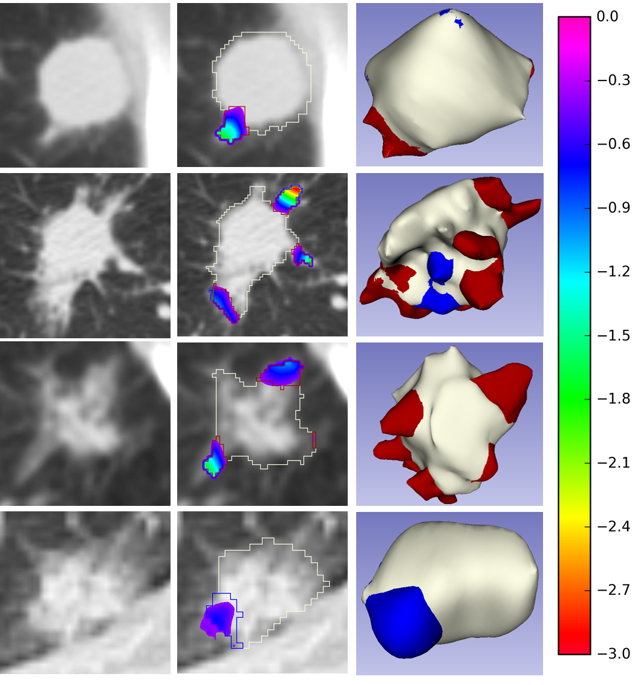
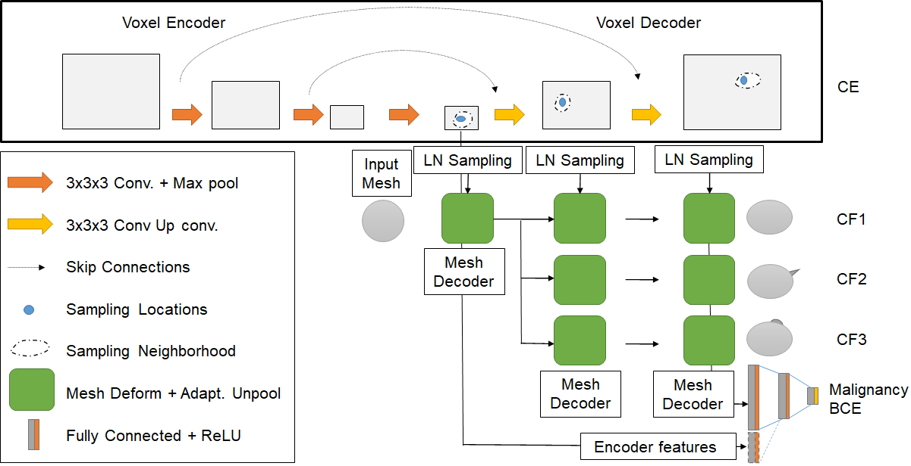

# Clinically-Interpretable Radiomics

This library serves as a one-stop solution for analyzing datasets using clinically-interpretable radiomics (CIR) in cancer imaging. The primary motivation for this comes from our collaborators in radiology and radiation oncology inquiring about the importance of clinically-reported features in state-of-the-art deep learning malignancy/recurrence/treatment response prediction algorithms. Previous methods have performed such prediction tasks but without robust attribution to any clinically reported/actionable features (see extensive literature on sensitivity of attribution methods to hyperparameters). This motivated us to curate datasets by annotating clinically-reported features at voxel/vertex-level on public datasets (using our published [advanced mathmetical algorithms](https://github.com/taznux/LungCancerScreeningRadiomics)) and relating these to prediction tasks (bypassing the “flaky” attribution schemes). With the release of these comprehensively-annotated datasets, we hope that previous malignancy prediction methods can also validate their explanations and provide clinically-actionable insights. We also provide strong end-to-end baselines for extracting these hard-to-compute clinically-reported features and using these in different prediction tasks. 

## CIRDataset: A large-scale Dataset for Clinically-Interpretable lung nodule Radiomics and malignancy prediction [MICCAI'22]

*Spiculations/lobulations, sharp/curved spikes on the surface of lung nodules, are good predictors of lung cancer malignancy and hence, are routinely assessed and reported by radiologists as part of the standardized Lung-RADS clinical scoring criteria. Given the 3D geometry of the nodule and 2D slice-by-slice assessment by radiologists, manual spiculation/lobulation annotation is a tedious task and thus no public datasets exist to date for probing the importance of these clinically-reported features in the SOTA malignancy prediction algorithms. As part of this paper, we release a large-scale Clinically-Interpretable Radiomics Dataset, CIRDataset, containing 956 radiologist QA/QC'ed spiculation/lobulation annotations on segmented lung nodules from two public datasets, LIDC-IDRI (N=883) and LUNGx (N=73). We also present an end-to-end deep learning model based on multi-class Voxel2Mesh extension to segment nodules (while preserving spikes), classify spikes (sharp/spiculation and curved/lobulation), and perform malignancy prediction. Previous methods have performed malignancy prediction for LIDC and LUNGx datasets but without robust attribution to any clinically reported/actionable features (due to known hyperparameter sensitivity issues with general attribution schemes). With the release of this comprehensively-annotated dataset and end-to-end deep learning baseline, we hope that malignancy prediction methods can validate their explanations, benchmark against our baseline, and provide clinically-actionable insights. Dataset, code, and pretrained models are available in this repository.*

## Dataset
The first CIR dataset, released [here](https://zenodo.org/record/6672251), contains almost 1000 radiologist QA/QC’ed spiculation/lobulation annotations (computed using our published [LungCancerScreeningRadiomics](https://github.com/taznux/LungCancerScreeningRadiomics) library and QA/QC'ed by a radiologist) on segmented lung nodules for two public datasets, LIDC (with visual radiologist malignancy RM scores for the entire cohort and pathology-proven malignancy PM labels for a subset) and LUNGx (with pathology-proven size-matched benign/malignant nodules to remove the effect of size on malignancy prediction). 
*Nodule spiculation quantification dataset samples; the first column - input CT image; the second column - superimposed area distortion map and contours of each classifications on the input CT image; the third column - 3D mesh model with vertices classifications; red: spiculations, blue: lobulations, white: nodule.*

## End-to-End Deep Learning Nodule Segmentation, Spikes' Classification, and Malignancy Prediction Model

We also release our multi-class [Voxel2Mesh](https://github.com/cvlab-epfl/voxel2mesh) extension to provide a strong benchmark for end-to-end deep learning lung nodule segmentation, spikes’ classification (lobulation/spiculation), and malignancy prediction; Voxel2Mesh is the only published method to our knowledge that preserves sharp spikes during segmentation and hence its use as our base model. With the release of this comprehensively-annotated dataset, we hope that previous malignancy prediction methods can also validate their explanations/attributions and provide clinically-actionable insights. Users can also generate spiculation/lobulation annotations from scratch for LIDC/LUNGx as well as new datasets using our [LungCancerScreeningRadiomics](https://github.com/taznux/LungCancerScreeningRadiomics) library.

*Depiction of IRT architecture based on Voxel2Mesh. The standard UNet based voxel encoder/decoder (top) extracts features from the input CT volumes while the mesh decoder deforms an initial spherical mesh into increasing finer resolution meshes matching the target shape. The mesh deformation utilizes feature vectors sampled from the voxel decoder through the Learned Neighborhood (LN) Sampling technique and also performs adaptive unpooling with increased vertex counts in high curvature areas. We extend the architecture by introducing extra mesh decoder layers for spiculation and lobulation classification. We also sample vertices (shape features) from the final mesh unpooling layer as input to Fully Connected malignancy prediction network. We optionally add deep voxel-features from the last voxel encoder layer to the malignancy prediction network.*

## Installation
It is highly recommended to install dependencies in either a python virtual environment or anaconda environment. Instructions for python virtual environment:
```bash
python3 -m venv venv
source venv/bin/activate
(venv) pip install torch torchvision torchaudio --extra-index-url https://download.pytorch.org/whl/cu113
(venv) pip install --no-index --no-cache-dir pytorch3d -f https://dl.fbaipublicfiles.com/pytorch3d/packaging/wheels/py38_cu113_pyt1110/download.html
(venv) pip install wandb sklearn scikit-image ipython ninja pandas opencv-python tqdm
```
Please refer to the this [link](https://github.com/facebookresearch/pytorch3d/blob/main/INSTALL.md#3-install-wheels-for-linux) for the details of pytorch3d installation.

## Usage
```bash
git clone --recursive git@github.com:nadeemlab/CIR.git
```
Step 1: Update config.py. You may need to set the path to the dataset and also the directory to save the results. All ready to train/test data is available [here](https://zenodo.org/record/6672251).

Step 2: You have to first perform data pre-processing. `python data_preprocess.py`

Step 3: Now execute `python main.py` and this will start training the network.

Step 4: Test the trained model. `python test.py`

### Data preprocessing
Pre-processed data will be saved at the dataset directory.

Step 2.0: Generate nrrd files using LungCancerScreeningRadiomics
- Lung nodule spiculation data can be generated from the scratch using [LungCancerScreeninigRadiomics](https://github.com/taznux/LungCancerScreeningRadiomics) for LIDC-IDRI and LUNGx dataset.  

- Preprocessed data is available [here](https://zenodo.org/record/6672251).
```bash
   tar xjvf CIRDataset_LCSR.tar.bz2
```

Step 2.1: Convert isotropic voxel data from LungCancerScreeningRadiomics to 64x64x64 cubic image patch for 3D CNN models (dataset/NoduleDataset.py)
- Input: Each case consists of four nrrd files (SimpleITK)  
    LIDC-IDRI-0001_CT_1-all.nrrd                - CT Image  
    LIDC-IDRI-0001_CT_1-all-ard.nrrd            - Area Distortion Map  
    LIDC-IDRI-0001_CT_1-all-label.nrrd          - Nodule Segmentation  
    LIDC-IDRI-0001_CT_1-all-spikes-label.nrrd    - Spike Classification - Spiculation:1, Lobulation: 2, Attachment: 3  
- Output: Each case consists of four npy files (numpy) - 64x64x64 cubic image patch  
    LIDC-IDRI-0001_iso0.70_s_0_CT.npy           - CT Image  
    LIDC-IDRI-0001_iso0.70_s_0_ard.npy          - Area Distortion Map  
    LIDC-IDRI-0001_iso0.70_s_0_nodule.npy       - Nodule Segmentation  
    LIDC-IDRI-0001_iso0.70_s_0_spikes.npy        - Spike Classification - Spiculation:1, Lobulation: 2, Attachment: 3  

- Preprocessed data is available [here](https://zenodo.org/record/6672251).
```bash
   tar xjvf CIRDataset_npy_for_cnn.tar.bz2
```
  
Step 2.2: Divide datasets into subsets (Training, Validation, Testing), extract surface voxels, and combine voxel data and outcome data (dataset/lidc.py & dataset/lungx.py)
- Input: Output from the previous step and outcome data  
  LIDC.csv - Raiological malignancy (RM) only  
  LIDC72.csv - RM and pathoogical malignancy (PM)  
  LUNGx.csv - PM only  
- Output: pickle files for each subset  
  pre_computed_data_trainig_64_64_64.pickle  
  pre_computed_data_validation_64_64_64.pickle (LUNGx does not have this)  
  pre_computed_data_testing_64_64_64.pickle  

- Preprocessed data is available [here](https://zenodo.org/record/6672251).
```bash
   tar xjvf CIRDataset_pickle_for_voxel2mesh.tar.bz2
```

### Running Pre-trained Models
- Coming Soon
- Docker containers Coming Soon

## Acknowledgments
* This code is inspired by [Voxel2Mesh](https://github.com/cvlab-epfl/voxel2mesh).

## Reference
If you find our work useful in your research or if you use parts of this code, please cite our paper:
```
@article{choi2022cirdataset,
  title={CIRDataset: A large-scale Dataset for Clinically-Interpretable lung nodule Radiomics and malignancy prediction},
  author={Choi, Wookjin and Dahiya, Navdeep and Nadeem, Saad},
  journal={International Conference on Medical Image Computing and Computer-Assisted Intervention (MICCAI)},
  year={2022},
}
```
